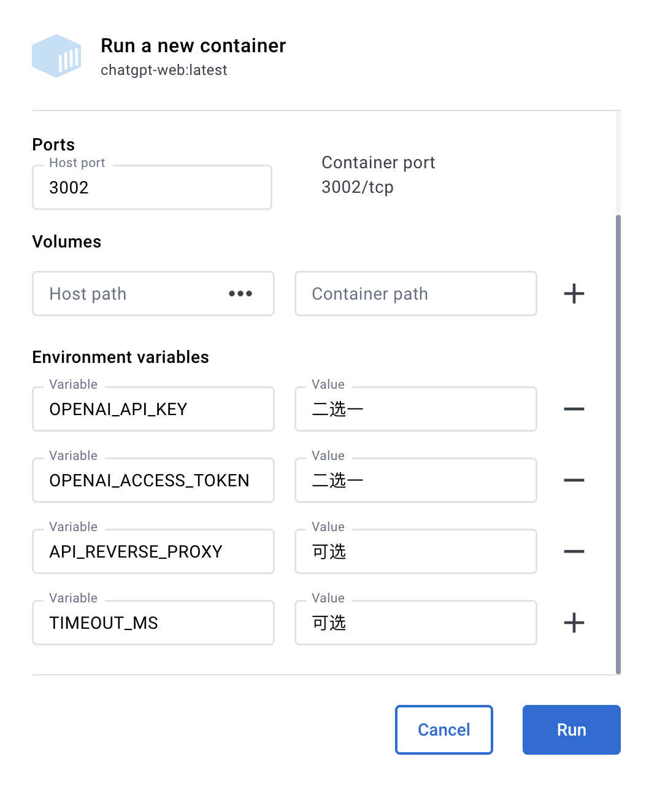

切换方式：
1. 进入 `service/.env.example` 文件，复制内容到 `service/.env` 文件
2. 使用 `OpenAI API Key` 请填写 `OPENAI_API_KEY` 字段 [(获取 apiKey)](https://platform.openai.com/overview)
3. 使用 `Web API` 请填写 `OPENAI_ACCESS_TOKEN` 字段 [(获取 accessToken)](https://chat.openai.com/api/auth/session)
4. 同时存在时以 `OpenAI API Key` 优先

环境变量：

全部参数变量请查看或[这里](#环境变量)

```
/service/.env.example
```

## 待实现路线
[✓] 双模型

[✓] 多会话储存和上下文逻辑

[✓] 对代码等消息类型的格式化美化处理

[✓] 访问权限控制

[✓] 数据导入、导出

[✓] 保存消息到本地图片

[✓] 界面多语言

[✓] 界面主题

[✗] More...

## 前置要求

### Node

`node` 需要 `^16 || ^18 || ^19` 版本（`node >= 14` 需要安装 [fetch polyfill](https://github.com/developit/unfetch#usage-as-a-polyfill)），使用 [nvm](https://github.com/nvm-sh/nvm) 可管理本地多个 `node` 版本

```shell
node -v
```

### PNPM
如果你没有安装过 `pnpm`
```shell
npm install pnpm -g
```

### 填写密钥
获取 `Openai Api Key` 或 `accessToken` 并填写本地环境变量 [跳转](#介绍)

```
# service/.env 文件

# OpenAI API Key - https://platform.openai.com/overview
OPENAI_API_KEY=

# change this to an `accessToken` extracted from the ChatGPT site's `https://chat.openai.com/api/auth/session` response
OPENAI_ACCESS_TOKEN=
```

## 安装依赖

> 为了简便 `后端开发人员` 的了解负担，所以并没有采用前端 `workspace` 模式，而是分文件夹存放。如果只需要前端页面做二次开发，删除 `service` 文件夹即可。

### 后端

进入文件夹 `/service` 运行以下命令

```shell
pnpm install
```

### 前端
根目录下运行以下命令
```shell
pnpm bootstrap
```

## 测试环境运行
### 后端服务

进入文件夹 `/service` 运行以下命令

```shell
pnpm start
```

### 前端网页
根目录下运行以下命令
```shell
pnpm dev
```

## 环境变量

`API` 可用：

- `OPENAI_API_KEY` 和 `OPENAI_ACCESS_TOKEN` 二选一
- `OPENAI_API_MODEL`  设置模型，可选，默认：`gpt-3.5-turbo`
- `OPENAI_API_BASE_URL` 设置接口地址，可选，默认：`https://api.openai.com`
- `OPENAI_API_DISABLE_DEBUG` 设置接口关闭 debug 日志，可选，默认：empty 不关闭

`ACCESS_TOKEN` 可用：

- `OPENAI_ACCESS_TOKEN`  和 `OPENAI_API_KEY` 二选一，同时存在时，`OPENAI_API_KEY` 优先
- `API_REVERSE_PROXY` 设置反向代理，可选，默认：`https://ai.fakeopen.com/api/conversation`，[社区](https://github.com/transitive-bullshit/chatgpt-api#reverse-proxy)（注意：只有这两个是推荐，其他第三方来源，请自行甄别）

通用：

- `AUTH_SECRET_KEY` 访问权限密钥，可选
- `MAX_REQUEST_PER_HOUR` 每小时最大请求次数，可选，默认无限
- `TIMEOUT_MS` 超时，单位毫秒，可选
- `SOCKS_PROXY_HOST` 和 `SOCKS_PROXY_PORT` 一起时生效，可选
- `SOCKS_PROXY_PORT` 和 `SOCKS_PROXY_HOST` 一起时生效，可选
- `HTTPS_PROXY` 支持 `http`，`https`, `socks5`，可选
- `ALL_PROXY` 支持 `http`，`https`, `socks5`，可选

## 打包

### 使用 Docker

#### Docker 参数示例



#### Docker build & Run

```bash
docker build -t chatgpt-web .

# 前台运行
docker run --name chatgpt-web --rm -it -p 127.0.0.1:3002:3002 --env OPENAI_API_KEY=your_api_key chatgpt-web

# 后台运行
docker run --name chatgpt-web -d -p 127.0.0.1:3002:3002 --env OPENAI_API_KEY=your_api_key chatgpt-web

# 运行地址
http://localhost:3002/
```

#### Docker compose

[Hub 地址](https://hub.docker.com/repository/docker/chenzhaoyu94/chatgpt-web/general)

```yml
version: '3'

services:
  app:
    image: chenzhaoyu94/chatgpt-web # 总是使用 latest ,更新时重新 pull 该 tag 镜像即可
    ports:
      - 127.0.0.1:3002:3002
    environment:
      # 二选一
      OPENAI_API_KEY: sk-xxx
      # 二选一
      OPENAI_ACCESS_TOKEN: xxx
      # API接口地址，可选，设置 OPENAI_API_KEY 时可用
      OPENAI_API_BASE_URL: xxx
      # API模型，可选，设置 OPENAI_API_KEY 时可用，https://platform.openai.com/docs/models
      # gpt-4, gpt-4-0314, gpt-4-0613, gpt-4-32k, gpt-4-32k-0314, gpt-4-32k-0613, gpt-3.5-turbo-16k, gpt-3.5-turbo-16k-0613, gpt-3.5-turbo, gpt-3.5-turbo-0301, gpt-3.5-turbo-0613, text-davinci-003, text-davinci-002, code-davinci-002
      OPENAI_API_MODEL: xxx
      # 反向代理，可选
      API_REVERSE_PROXY: xxx
      # 访问权限密钥，可选
      AUTH_SECRET_KEY: xxx
      # 每小时最大请求次数，可选，默认无限
      MAX_REQUEST_PER_HOUR: 0
      # 超时，单位毫秒，可选
      TIMEOUT_MS: 60000
      # Socks代理，可选，和 SOCKS_PROXY_PORT 一起时生效
      SOCKS_PROXY_HOST: xxx
      # Socks代理端口，可选，和 SOCKS_PROXY_HOST 一起时生效
      SOCKS_PROXY_PORT: xxx
      # HTTPS 代理，可选，支持 http，https，socks5
      HTTPS_PROXY: http://xxx:7890
```
- `OPENAI_API_BASE_URL`  可选，设置 `OPENAI_API_KEY` 时可用
- `OPENAI_API_MODEL`  可选，设置 `OPENAI_API_KEY` 时可用

#### 防止爬虫抓取

**nginx**

将下面配置填入nginx配置文件中，可以参考 `docker-compose/nginx/nginx.conf` 文件中添加反爬虫的方法

```
    # 防止爬虫抓取
    if ($http_user_agent ~* "360Spider|JikeSpider|Spider|spider|bot|Bot|2345Explorer|curl|wget|webZIP|qihoobot|Baiduspider|Googlebot|Googlebot-Mobile|Googlebot-Image|Mediapartners-Google|Adsbot-Google|Feedfetcher-Google|Yahoo! Slurp|Yahoo! Slurp China|YoudaoBot|Sosospider|Sogou spider|Sogou web spider|MSNBot|ia_archiver|Tomato Bot|NSPlayer|bingbot")
    {
      return 403;
    }
```

###  使用 Railway 部署

[](https://railway.app/new/template/yytmgc)

#### Railway 环境变量

| 环境变量名称          | 必填                   | 备注                                                                                               |
| --------------------- | ---------------------- | -------------------------------------------------------------------------------------------------- |
| `PORT`                | 必填                   | 默认 `3002`
| `AUTH_SECRET_KEY`          | 可选                   | 访问权限密钥                                        |
| `MAX_REQUEST_PER_HOUR`          | 可选                   | 每小时最大请求次数，可选，默认无限                                        |
| `TIMEOUT_MS`          | 可选                   | 超时时间，单位毫秒                                                                             |
| `OPENAI_API_KEY`      | `OpenAI API` 二选一    | 使用 `OpenAI API` 所需的 `apiKey` [(获取 apiKey)](https://platform.openai.com/overview)            |
| `OPENAI_ACCESS_TOKEN` | `Web API` 二选一       | 使用 `Web API` 所需的 `accessToken` [(获取 accessToken)](https://chat.openai.com/api/auth/session) |
| `OPENAI_API_BASE_URL`   | 可选，`OpenAI API` 时可用 |  `API`接口地址  |
| `OPENAI_API_MODEL`   | 可选，`OpenAI API` 时可用 |  `API`模型  |
| `API_REVERSE_PROXY`   | 可选，`Web API` 时可用 | `Web API` 反向代理地址 [详情](https://github.com/transitive-bullshit/chatgpt-api#reverse-proxy)    |
| `SOCKS_PROXY_HOST`   | 可选，和 `SOCKS_PROXY_PORT` 一起时生效 | Socks代理    |
| `SOCKS_PROXY_PORT`   | 可选，和 `SOCKS_PROXY_HOST` 一起时生效 | Socks代理端口    |
| `SOCKS_PROXY_USERNAME`   | 可选，和 `SOCKS_PROXY_HOST` 一起时生效 | Socks代理用户名    |
| `SOCKS_PROXY_PASSWORD`   | 可选，和 `SOCKS_PROXY_HOST` 一起时生效 | Socks代理密码    |
| `HTTPS_PROXY`   | 可选 | HTTPS 代理，支持 http，https, socks5    |
| `ALL_PROXY`   | 可选 | 所有代理 代理，支持 http，https, socks5    |

> 注意: `Railway` 修改环境变量会重新 `Deploy`

### 手动打包
#### 后端服务
> 如果你不需要本项目的 `node` 接口，可以省略如下操作

复制 `service` 文件夹到你有 `node` 服务环境的服务器上。

```shell
# 安装
pnpm install

# 打包
pnpm build

# 运行
pnpm prod
```

PS: 不进行打包，直接在服务器上运行 `pnpm start` 也可

#### 前端网页

1、修改根目录下 `.env` 文件中的 `VITE_GLOB_API_URL` 为你的实际后端接口地址

2、根目录下运行以下命令，然后将 `dist` 文件夹内的文件复制到你网站服务的根目录下

[参考信息](https://cn.vitejs.dev/guide/static-deploy.html#building-the-app)

```shell
pnpm build
```
